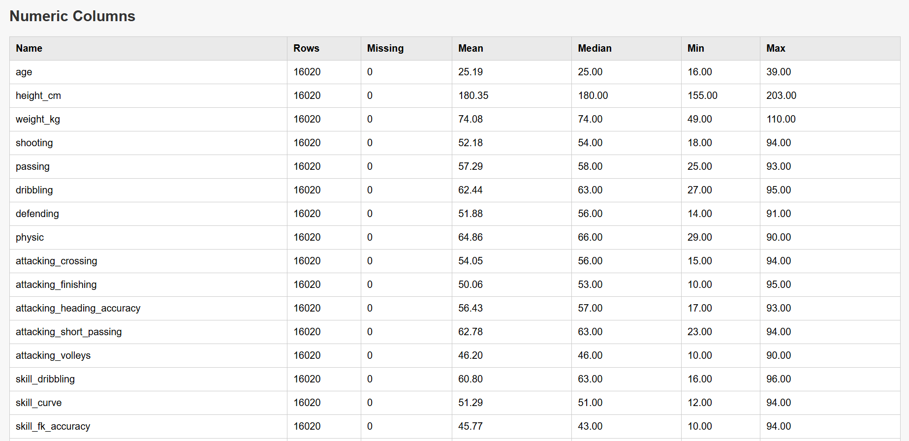
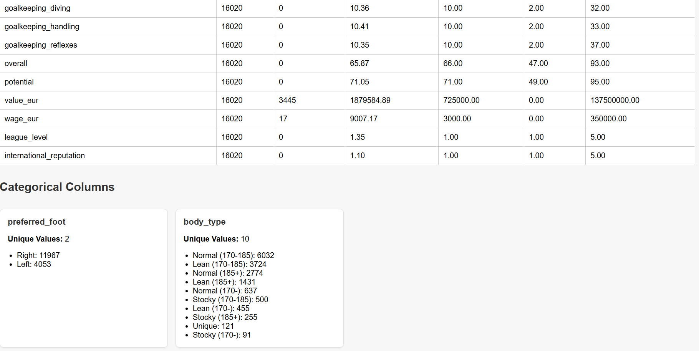

## Goals

In this tutorial my goal is to apply a preprocessing on a dataset I often use to teach data analysis. The dataset is contains FIFA soccer players characteristics. 

Using `preprocess` only I want to be able to : 
- Explore the dataset : know how many rows and columns it contains
- Explore summary statistics on numeric columns : number of missing, minimum, mean, median and maximum values
- Explore summary statistics on text columns : number of missing, modalities count
- Fill numeric missing values with the mean of every column
- Scale numeric columns : apply zscore to every column

### Computer specs

I am using a Windows 10 Pro Workstation. Intel i7 with 32GB of RAM


### Explore the dataset 

#### Download the dataset 

I am using a Windows system, with Powershell I can easily download the dataset via the command line. Using Powershell `Invoke-WebRequest` I have successfully downloaded the dataset from the Github repo that holds it. I encourage you to try if you want. 
Depending on your system you may use curl or any other way to download the data as a text file. 
The data is available here : https://raw.githubusercontent.com/agailloty/Outils-Analyses-R/refs/heads/main/dataset/fifa_players_22.csv

```powershell
Invoke-WebRequest -Uri https://raw.githubusercontent.com/agailloty/Outils-Analyses-R/refs/heads/main/dataset/fifa_players_22.csv -Outfile "fifa_players.csv"
```

In my case, I save it on my system as `fifa_players.csv`. It's with this file name that I will use the preprocess CLI command. 

## Skim through the data

preprocess provides a convenient command for you to have a glance at the dataset. 

For every preprocess command there is a built-in documentation to help you choose the right parameters for the task. Using the --help tag you can explore the documentation of the command you wish to use. Even I myself use this quite often. 

```
preprocess skim --help
```

will display 

```
Print a subset of the dataset in the console

Usage:
  preprocess skim [flags]

Flags:
  -d, --data string       Path to the dataset
  -m, --dsep string       Decimal separator (default ".")
  -e, --encoding string   Character encoding (default "utf-8")
  -h, --help              help for skim
  -s, --sep string        Separator for csv file (default ",")
```

Simply use the following command to skim through the dataset : 

```powershell
preprocess skim --data .\fifa_players.csv
```

By default `preprocess skim` will read the CSV dataset with a coma `,` as the delimeter. You can specify another delimiter using the `--sep` flag. 

The following command produces the same output as the previous. In the latter I explicitely set the delimiter.

```powershell
preprocess skim --data .\fifa_players.csv --sep ","
```

```
Columns: 49 | Total rows: 16021

short_name         age  height_cm  weight_kg  [...]  wage_eur  league_level  international_reputation  preferred_foot  body_type
-----------------  ---  ---------  ---------  -----  --------  ------------  ------------------------  --------------  ----------------
L, Messi           34   170        72         [...]  320000    1             5                         Left            Unique
R, Lewandowski     32   185        81         [...]  270000    1             5                         Right           Unique
Cristiano Ronaldo  36   187        83         [...]  270000    1             5                         Right           Unique
Neymar Jr          29   175        68         [...]  270000    1             5                         Right           Unique
K, De Bruyne       30   181        70         [...]  350000    1             4                         Right           Unique
K, Mbappé          22   182        73         [...]  230000    1             4                         Right           Unique
```

This commands print the first 30 lines of the dataset and 10 columns. It is just a convenient way to quickly see how the dataset looks.

**Goal 1 solved :the dataset contains 16021 rows and 49 columns**.

## Explore summary statistics

Now I would like to explore more the dataset. This time in terms of statistics to have a better idea of its structure. 

preprocess offers you two ways to explore your dataset : 
- produce a TOML file with the summary statistics of all columns
- produce a HTML report to help you explore the summary statistics through your web browser

### Using Summaryfile.toml

With the following command you can produce a TOML file that contains summary statistics of each column present in the dataset. 

First let's display the help for this command

```
Generate dataset summary statistics.
        By default it generates a TOML file that contains all summary statistics.
        You can choose to generate a HTML file with the --html flag.

Usage:
  preprocess summary [flags]

Flags:
  -d, --data string       Path to the dataset
  -m, --dsep string       Decimal separator (default ".")
  -e, --encoding string   Character encoding (default "utf-8")
  -h, --help              help for summary
  -t, --html              Generate HTML file
  -o, --output string     Output name for Summaryfile (default "Summaryfile.toml")
  -f, --prepfile string   Path to the configuration file (default "Prepfile.toml")
  -s, --sep string        Separator for csv file (default ",")
```

```powershell
preprocess summary --data .\fifa_players.csv --output fifa_stats.toml
```
If it is successful then you will have the following message displayed. 
```
fifa_stats.toml successfully generated.
Finished in : 254.9019ms
```

Now you can open and explore the content of the fifa_stats.toml file. 
Below is a subset of the fifa_stats.toml file. 

```toml
[data]
filename = '.\fifa_players.csv'
csv_separator = ','
decimal_separator = '.'
encoding = 'utf-8'
missing_identifier = ''

[data_summary]
rows_count = 16020
columns_count = 48
numeric_columns = 46
string_columns = 2

[[columns]]
name = 'age'
type = 'numeric'
rows_count = 16020
min = 16.0
mean = 25.19307116104869
median = 25.0
max = 39.0
missing = 0

[[columns]]
name = 'height_cm'
type = 'numeric'
rows_count = 16020
min = 155.0
mean = 180.3483770287141
median = 180.0
max = 203.0
missing = 0
```

You can exclude some columns from the summary using the `--exclude` flag. 
For my case I want to exclude the __short_name__ from the summary because it is just the names of the players. There is no added values to counting the occurence of the names. 

```
preprocess summary --data .\fifa_players.csv --exclude short_name --output fifa_stats.toml
```

### Using an HTML report

To generate HTML report, you just need to append the `--html` tag to the previous command. 

```bash
preprocess summary --data .\fifa_players.csv --exclude short_name --output fifa_stats.toml --html
```

It will generate a HTML file that contains the summary statistics. You can use yout web browser to explore the summary statistics. 

As an example, you will have a web page that looks like the following : 



The remaining statistics



**Goal 2 solved : I am able to explore summary statistics on numeric and text columns**

## Preprocessing the data 

Now let's explore how to use preprocess CLI for data preprocessing. Let's suppose we want to preprocess the data so we can feed it later in a machine learning pipeline.

### Introducting Prepfile

If you have worked with tools such as Docker you'll notice that they give the user the ability to declare operations they wish to perform using simple files such as `Dockerfile` or `compose.yml`. 

Preprocess CLI implements a similar idea with the Prepfile.toml

With the `init` command you can use Preprocess CLI to generate a Prepfile. 
The Prepfile contains three sections : 
- Data section [data]
- Preprocess section [preprocess]
- Postprocess section [postprocess]

In the data section you provide all necessary information to read the dataset on which you want to apply the operations. 
The preprocess section contains the operations that will be applied on the dataset. 
The postprocess section contains what to do after the preprocessing steps. 

### Generate the Prepfile for this project

Let's use the `init` command to generate a Prepfile for our dataset. 

```
preprocess init --help
```

```
This command is used to generate a Prepfile in which you can specify the preprocessing computations either on specifics columns of the dataset or on whole numeric or text columns.

Usage:
  preprocess init [flags]

Flags:
  -d, --data string       Path to the dataset
  -m, --dsep string       Decimal separator (default ".")
  -e, --encoding string   Character encoding (default "utf-8")
  -h, --help              help for init
  -o, --output string     Output name for Prepfile (default "Prepfile.toml")
  -s, --sep string        Separator for csv file (default ",")
  -t, --template          Generate example Prepfile.toml template
```

```powershell
preprocess init --data .\fifa_players.csv
```

If you provide only the `--data` flag it will default utf-8 for character encoding, `,` for csv separator and `.` for decimal separator. 

The Prepfile can be quite long depending on the columns the dataset has. For brevity I show a truncated version of the Prepfile below. 

```toml
[data]
filename = '.\fifa_players.csv'
csv_separator = ','
decimal_separator = '.'
encoding = 'utf-8'
missing_identifier = ''

[preprocess]
[[preprocess.columns]]
name = 'short_name'
type = 'string'

[[preprocess.columns]]
name = 'age'
type = 'int'

[[preprocess.columns]]
name = 'height_cm'
type = 'int'


[[preprocess.columns]]
name = 'wage_eur'
type = 'int'

[[preprocess.columns]]
name = 'league_level'
type = 'int'

[[preprocess.columns]]
name = 'international_reputation'
type = 'int'

[[preprocess.columns]]
name = 'preferred_foot'
type = 'string'

[[preprocess.columns]]
name = 'body_type'
type = 'string'

[postprocess]
format = 'csv'
filename = 'fifa_players_cleaned.csv'

```

With Prepfile I can apply operations on individual columns of the dataset. 
For example if I want to fill the missing values of the column `wage_eur` with the mean value of the column (excluded missing values), I will do the following. 

```toml
[[preprocess.columns]]
name = 'wage_eur'
type = 'int'
operations = [
  {op = "fillna", method = "mean"}
]
```